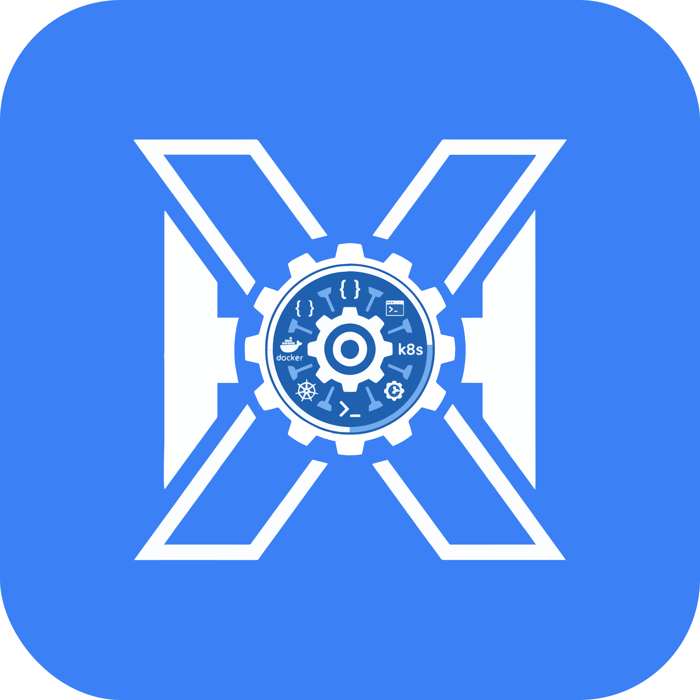
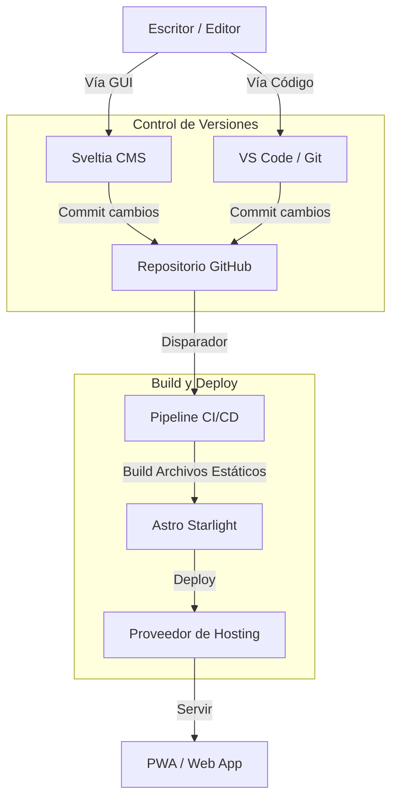

# 📚 Docs Starlight

> **Tu Segundo Cerebro.** — Un centro de documentación premium, listo para PWA, impulsado por Astro Starlight y Sveltia CMS.

<!-- BADGES -->
[](https://astro.build)
[](https://starlight.astro.build)
[](https://github.com/sveltia/sveltia-cms)
[](LICENSE)

<p align="center">
  
  <br>
  <em>(Reemplaza esto con una captura de tu dashboard)</em>
</p>

---

## ✨ Características

| Característica       | Descripción                                                                 |
| :------------------- | :-------------------------------------------------------------------------- |
| 📚 **Core Starlight** | Construido sobre el potente framework Astro 5 para una velocidad increíble. |
| ✏️ **CMS Visual**     | **Sveltia CMS** integrado para gestionar contenido sin tocar código.        |
| 📱 **Lista para PWA** | Totalmente instalable como app nativa en Móvil y Escritorio.                |
| 🎨 **UI Premium**     | Componentes estilizados, modo oscuro y estética moderna.                    |
| 🔍 **SEO Optimizado** | Sitemaps automáticos, meta tags y generación de open graph.                 |

---

## 🚀 Inicio Rápido

### Requisitos
- Node.js 18+
- Git instalado
- Cuenta de GitHub (para el backend del CMS)

### 1. Crea tu proyecto
Puedes usar **GitHub CLI** para clonar esta plantilla directamente:

```bash
# Clonar el repositorio
gh repo clone herwingx/docs-starlight mis-docs

# Entrar al directorio
cd mis-docs
```

### 2. Instalar dependencias
```bash
npm install
```

### 3. Iniciar Servidor de Desarrollo
```bash
npm run dev
```

**URLs Locales:**
- 📖 **Docs:** `http://localhost:4321`
- 🎛️ **Admin:** `http://localhost:4321/admin/`

---

## 🏗️ Arquitectura



---

## 📦 Opciones de Despliegue

Esta plantilla es agnóstica a la nube. Puedes desplegarla donde sea que se soporten sitios estáticos.

| Plataforma           | Configuración                       | Comando         |
| :------------------- | :---------------------------------- | :-------------- |
| **Cloudflare Pages** | Conectar Repo → Preset: `Astro`     | `npm run build` |
| **GitHub Pages**     | Settings → Source: `GitHub Actions` | `npm run build` |
| **Vercel**           | Import Project → Preset: `Astro`    | `npm run build` |
| **Netlify**          | Import Project → Preset: `Astro`    | `npm run build` |

### Usando GitHub CLI para Deploy (Ejemplo)
Si quieres configurar GitHub Pages rápidamente:

```bash
# Habilitar GitHub Pages vía Actions
gh repo edit --enable-pages --source-branch main --source-path /
```

---

## 📝 Gestión de Contenido

### Usando el CMS Visual
1. Navega a `/admin/`.
2. Inicia sesión con tu cuenta de GitHub.
3. Crea o edita colecciones visualmente.
4. Las actualizaciones se commitean automáticamente a tu repo.

### Edición Manual (MDX)
Crea nuevos archivos `.mdx` en `src/content/docs/`:

```mdx
---
title: Mi Nueva Página
description: Una descripción para SEO
---

# Hola Mundo
Esta es una nueva página de documentación.
```

---

## 🔧 Comandos Útiles

| Comando           | Acción                                          |
| :---------------- | :---------------------------------------------- |
| `npm run dev`     | Iniciar servidor de desarrollo local            |
| `npm run build`   | Compilar para producción                        |
| `npm run preview` | Previsualizar la build de producción localmente |
| `npm run dev:cms` | Correr servidor dev con proxy local para CMS    |

---

## 🛠️ Stack Tecnológico

**Frontend**
- **Framework**: Astro 5
- **Tema**: Starlight theme
- **Estilos**: Variables CSS + Glassmorphism Personalizado

**Herramientas**
- **CMS**: Sveltia CMS (Basado en Git)
- **Iconos**: Phosphor / Astro Icon
- **PWA**: Plugin Vite PWA

---

## 🤝 Contribuir y Licencia

Siéntete libre de hacer un fork de este proyecto y usarlo como base para tu propia documentación.

1. Fork del repo: `gh repo fork herwingx/docs-starlight`
2. Crear rama: `git checkout -b feature/docs-increibles`
3. Commit cambios: `git commit -m 'feat: agregar docs increibles'`
4. Push: `git push origin feature/docs-increibles`

Licenciado bajo **MIT**.
